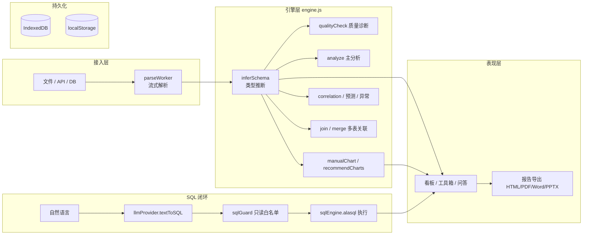

# 数据分析 Agent · Data Analysis Agent

> 纯前端、零部署的一站式数据分析工具。用户数据全程驻留浏览器，**原始数据不出本机**（隐私优先）。
> 从文件 / API / 数据库接入数据，经流式解析、清洗、质量诊断后，自动生成看板、图表、Text-to-SQL 问答与多格式报告。

[](https://github.com/your-name/data-analysis-agent/actions)
[](#测试)
[](#)

---

## ✨ 核心功能

| 模块 | 说明 |
|---|---|
| **多源数据接入** | CSV / Excel / JSON / 日志 / HTTP API；支持多数据集工作台 + 自动关联键检测 + 联合分析（关联 / 堆叠） |
| **大文件流式解析** | Web Worker + `File.stream()` 流式解码，>8MB 自动走流式，带进度 / 取消 / 采样；实测 **56 万行 / 15MB ≈ 8.9s**，主线程不卡顿 |
| **分析看板** | 数据质量评分、AI 分析结论（LLM / 规则双模式）、智能图表、交互式筛选 / 下钻 / 联动 |
| **分析工具箱** | 时间趋势 / Top N / 同环比 / 相关性 / 透视表 / 列画像 + **⚡ 智能图表推荐（8 类，自动按数据特征匹配）** |
| **数据清洗** | 缺失填充 / 去重 / 异常值处理，抽样预览 |
| **模板库** | 保存 / 复用分析模板，**跨表语义角色映射**（`matchTemplate`），模板仅含配置不含原始数据 |
| **深度追问（Text-to-SQL）** | 自然语言 → SQL（LLM 或规则生成）→ 只读白名单校验 → alasql 真实执行 → 结果表 + 图表 |
| **报告导出** | HTML / PDF（打印）/ Word / PPTX 四种格式 |
| **其他** | 定时调度（演示级）、外部数据库直连（需自部署 `db-proxy`）、暗色模式、图表 PNG / Excel / CSV 导出 |

---

## 🧱 技术栈

- **语言 / 框架**：JavaScript（ES2022 Modules）+ React 18.3 + Vite 5
- **可视化**：ECharts 5（含中国地图 GeoJSON 运行时拉取）
- **浏览器内 SQL 引擎**：alasql 4（动态 `import()`，不进首屏）
- **表格 / 文档**：SheetJS (xlsx)、pptxgenjs（动态加载）
- **并发解析**：原生 Web Worker（`File.stream()` + `TextDecoder` + 逐字符 CSV 状态机）
- **持久化**：IndexedDB（大文件分块落盘 / 数据集元数据）+ localStorage（配置 / 模板 / 调度）
- **LLM 服务**：OpenAI 兼容 `/v1/chat/completions`（baseURL + key 用户自配；未配置时降级内置规则引擎）
- **测试**：Vitest

> 架构取舍：纯前端 SPA，数据驻留浏览器内存 / IndexedDB —— **隐私优先、零后端部署**；仅在连接 LLM / 数据库时代理转发。

---

## 🏗️ 架构



---

## 🚀 快速开始

```bash
# 安装依赖
npm install

# 启动开发服务器（默认 http://localhost:5173）
npm run dev

# 生产构建
npm run build

# 运行单元测试
npm test
```

打开首页点击「示例数据」即可一键体验全流程。

---

## 🧪 测试

使用 Vitest，覆盖引擎层纯函数、状态层（Zustand store）与核心视图组件：

```bash
npm test           # 单次运行（94 项，11 个测试文件）
npm run coverage   # 运行并生成覆盖率报告（coverage/index.html）
npm run test:watch  # 监听模式
```

覆盖点（94 项，11 文件）：
- **引擎层**：CSV 解析与引号/换行容错、schema 语义推断、缺失值检测、**多表关联同源列自相关防护**、智能图表推荐、手动图表生成、SQL 只读白名单（拦截 DROP/UPDATE/DELETE/多语句/未知列）、alasql 真实执行（GROUP BY / 中文列名 / 截断）。
- **状态层（Zustand store）**：交叉筛选、数据集工作台与关联自动发现、分析流水线（mock 路径）、对话式追问规则 SQL 降级、数据导入与关联编排（join / merge / 联合对比分析）。
- **视图组件冒烟**：Home / Quality / SettingsPanel / ChatPanel / ChartToolbox 渲染与关键回调。
- **UI 交互（重点）**：Workbench 数据集卡片勾选/查看/删除/重命名/联合分析、Upload 四 tab 切换与多表关联、PreviewView / Dashboard 质量分·洞察·图表画廊·筛选下钻·动作按钮、ChartDetail / Report、EChart 占位与下载、TemplateLibrary 保存/应用/重命名/删除/导出与各类型 buildSpec、ScheduleView 创建/试跑/启停/删除/历史清空、DataPreview 虚拟滚动与列宽拖拽、CleanPanel 各清洗步骤/影响预览/suggestFixSteps。整体 src 行覆盖 **56.7%**（组件层普遍 70%~100%）。

---

## 🔐 安全说明

- **数据隐私**：原始数据仅存在于浏览器本地，不上传任何服务器。
- **Text-to-SQL 白名单**：仅允许单条只读 `SELECT`，强制列名白名单，拦截一切 DDL / DML / 分号多语句，杜绝 LLM 生成的危险语句执行。
- **报告导出转义**：所有数据 / LLM 输出写入 HTML 报告前经 `esc()` 转义，防止存储型 XSS。
- **LLM Key**：默认存于 localStorage（建议自配后端代理转发，避免明文长期留存；可在设置中选择「仅本次会话」不持久化）。

---

## 📐 目录结构

```
src/
  engine.js          # 引擎桶文件（barrel）：仅 re-export，真实实现见 engine/ 子模块
  engine/            # 引擎按职责拆分：_shared/parse/schema/clean/timeseries/pivot/charts/correlation
                     #   /manualChart/analyze/join/merge/export/recommend
  App.jsx            # 控制器：全局状态 + 视图路由编排（展示组件已抽到 components/）
  components/
    EChart.jsx       # ECharts 封装 + 地图底图 + 主题上色基建
    Views.jsx        # Home/Upload/PreviewView/Dashboard/ChartDetail/Quality/Report/SettingsPanel/ChatPanel
  Workbench.jsx      # 多数据集工作台
  ChartToolbox.jsx   # 分析工具箱 + 智能推荐
  TemplateLibrary.jsx / templateStore.js  # 模板库
  parseWorker.js / streamParse.js         # 大文件流式解析
  sqlGuard.js / sqlEngine.js / llmProvider.js  # Text-to-SQL 闭环
  reportExport.js    # 报告导出（HTML/Word/PDF/PPTX）
  schedule.js / ScheduleView.jsx          # 定时调度
  ...
server/db-proxy.mjs  # 可选：外部数据库直连代理
```

---

## ✅ 阶段性成果

- 完整数据分析闭环：接入 → 解析 → 清洗 → 质量 → 看板 → 问答 → 报告
- 4 大 PRD 模块全部落地：暗色模式 + 报告导出、大文件流式解析、模板复用、Text-to-SQL 闭环
- 工程规范：Vitest 单测、ESLint/Prettier、CI 工作流
